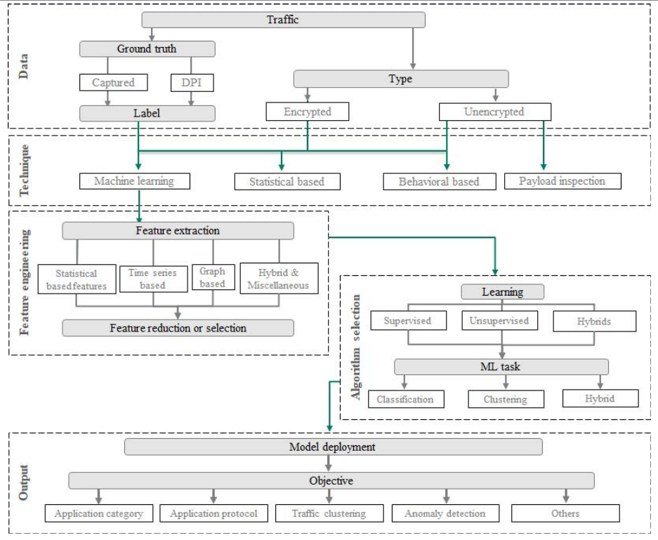
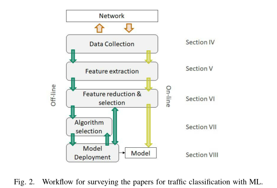
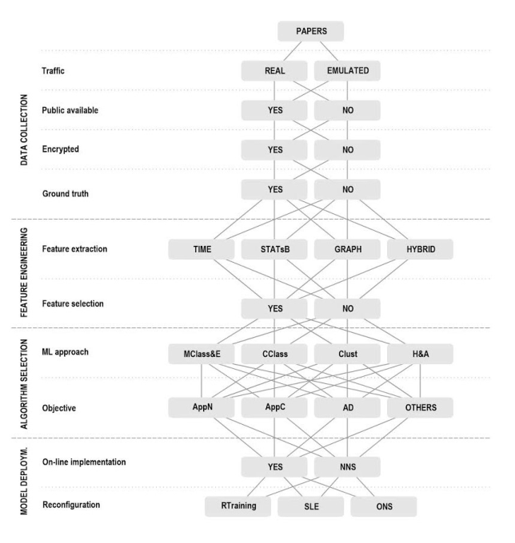

<!-- TOC -->

- [机器学习在网络流量分类中的应用](#机器学习在网络流量分类中的应用)
    - [I. 介绍](#i-介绍)
        - [A. 相关工作](#a-相关工作)
        - [B. 本文贡献](#b-本文贡献)
        - [C. 本文结构](#c-本文结构)
    - [II. 背景](#ii-背景)
        - [A. 机器学习介绍](#a-机器学习介绍)
            - [1. 数据收集](#1-数据收集)
            - [2. 特征提取FE](#2-特征提取fe)
            - [3.特征降维FR和特征选择FS](#3特征降维fr和特征选择fs)
            - [4. 算法选择和模型结构](#4-算法选择和模型结构)
            - [5. 分类模型验证](#5-分类模型验证)
        - [B. 流量分类](#b-流量分类)
            - [1. IP流定义](#1-ip流定义)
            - [2. 有效载荷检测](#2-有效载荷检测)
            - [3. 基于统计的技术](#3-基于统计的技术)
            - [4. 行为技术](#4-行为技术)
            - [5. 机器学习技术](#5-机器学习技术)
    - [III. 方法](#iii-方法)
    - [IV.数据收集](#iv数据收集)

<!-- /TOC -->
#机器学习在网络流量分类中的应用
> ***摘要***
> &emsp;&emsp;流量检测是一种发现网络流量中的关系、模式、异常和错误配置等的综合技术。尤其需要注意，流量分类是该领域中旨在识别应用程序名称或Internet流量类型的一个子领域。近年来，流量加密和封装等新技术的兴起降低了传统流量分类策略的性能，使得流量分类成为一项具有挑战性的任务。机器学习作为这一领域的一个新的研究方向，有成功的迹象，例如从加密流量中提取知识，以及更精确的服务质量管理。ML正迅速成为在真实的网络流量场景中构建流量分类解决方案的关键工具；从这个意义上说，本研究的目的是探索该技术在流量分类领域的要素。因此，本文在介绍利用ML技术实现流量分类的步骤的基础上，对其进行了系统的综述。主要目的是了解和确定现有工作为实现其目标所遵循的程序。因此，本文从对该领域进行的分析中发现了一些趋势；通过这种方式，作者希望概述基于ML的流量分类的未来方向。  

> &emsp;&emsp;***关键词：*** **互联网流量**，**流量分类**，**机器学习**，**流量监控**

## I. 介绍
&emsp;&emsp;流量分析是一个从截取流量数据开始，到发现网络中的关系、模式、异常和错误配置等的完整过程。其中，流量分类是该领域中的一个子领域，其目的在于将互联网流量分类为预定义的类别，例如正常或异常流量、应用程序类型（流媒体、网络浏览、VoIP等）或应用程序名称（YouTube、Netflix、Facebook等）。**流量检测之所以重要，主要有以下几方面的原因：**  
* **故障排除任务**：主要目标是定位故障网络设备、设备/软件配置错误、定位数据包丢失点、网络错误等。
* **安全性**：避免恶意软件或防止对私人信息的入侵。
* **服务质量（QoS）管理**，保证最终用户对应用程序或服务的总体可接受性。在这个领域，识别或分类网络中的应用程序的名称或类型有助于处理一些预先定义的情况。例如，从流量中识别不同的应用程序对于管理带宽资源和确保QoS要求至关重要。  

&emsp;&emsp;在过去，流量分类依赖于**基于端口**的方法，其中每个应用程序由其注册的已知端口进行标识，该端口由互联网分配号码管理局（IANA）[1]定义。由于未注册或随机生成端口的新应用程序激增等因素，这种方法变得不可靠和不准确。另一种在这一领域得到广泛应用的方法是**深度包检测（Deep Packet Inspection，DPI）**。DPI通过在包负载和一组存储的签名之间执行匹配对网络流量进行分类。然而，当隐私政策和法律阻止访问包内容以及协议混淆或封装的情况下，DPI会失败。为了克服上述问题，机器学习（ML）作为一种合适的解决方案应运而生，它不仅适用于流量分类任务，而且适用于预测和新知识发现等。在这种情况下，IP流的统计特征通常是从网络轨迹中提取出来的，并存储起来生成历史数据。这样，就可以用这些历史数据训练不同的ML模型，并用这些模型分析新的传入流。  

### A. 相关工作
&emsp;&emsp;在本节中，我们将研究一些综述性论文，以找出进行流量分析（尤其是流量分类）的趋势、挑战和一般步骤。虽然2005年已经开始使用ML进行流量分析，但是由于流量的更新和扩展等原因，一些问题仍然存在。文献[2]回顾了近年来利用ML进行流量分类的研究进展。尽管大多数呈现的工作都是以离线方式部署的，但是作者也提到了在线部署，为ML模型建立了一些关键的操作要求。在最近的一篇综述[3]中，指出了其中的几个问题，并提出了该领域的未来的一些方向。一方面，本文研究了一些**主要的流量分类问题，可以总结如下：**  
* 可用的数据及其真实性是有限的；
* 流量分类解决方案的可扩展性是一个挑战；
* 由于网络的动态性和进化性，需要自适应的解决方案；
* 解决方案需要正确的验证。    
  
&emsp;&emsp;另一方面，未来的方向鼓励对ML方法进行更严格的评估和比较，鼓励开发用于定义流量真实值的工具，鼓励使用多分类系统等。此外，ML方法需要满足不同的挑战[4]、[5]，例如提供的性能、对不断增加的业务量和传输速率的管理，以及重新配置能力。  
&emsp;&emsp;文献[6]介绍了这一领域的最新进展，重点介绍了用于流量分类的**有监督**和**无监督**技术。作者研究了几种**基于贝叶斯的分类器**、**神经网络NNs** 和**决策树DT**的方法。此外，还研究了**DBSCAN算法**、**基于期望最大化EM**和**K-均值**的聚类技术等。为了概述每种方法的必要改进，给出了一些优缺点。  
&emsp;&emsp;加密通信已成为防止网络中传输信息被入侵的一种新方法。ML非常适合分析这些类型的通信，因为它不会侵入数据包内容；例如，在某些情况下，连接的统计行为可能就足够了。在这一背景下，[7]报告了几项关于加密流量的研究的全面回顾。调查研究了一些加密协议、它们的包结构和在网络中的标准行为，以及可以提取用于流量分析的可观察特征。此外，[8]还调查了最常见的流量分类方法。  
&emsp;&emsp;目前，**网络中的异常流量检测**已成为流量分析的重要课题之一。其目的是发现或描述可能影响网络基础设施、业务或个人隐私、数字经济等的恶意或无意的异常情况。流量分析对于这个特定的域是必要的。参考文献[9]提出了一项综合研究，其中ML技术代表了本综述中发现的30%以上的解决方案。这一领域的更多工作见[10]-[12]。  
&emsp;&emsp;一般来说，流量分类可以通过多种ML技术，在不同的领域，以不同的目标来实现。然而，在所有的调查报告中，一个主要的问题是缺乏公共数据，这可以被视为应用ML方法的核心资源。此外，定义所收集数据的真实值的困难，以及ML解决方案的实现，是目前ML技术的挑战和限制。另外，另一个重要方面是网络的发展，它需要自适应或自配置的解决方案来保证可靠的通信量。相反，为了能够解决前面讨论过的缺点，研究界需要付出更多的努力。  

### B. 本文贡献
&emsp;&emsp;本文试图收集如何以及何时使用ML技术进行流量分类的不同方法、策略和过程。它将研究从监控阶段到实施ML解决方案的过程。主要目的是为打算使用ML技术进行流量分类的领域从业人员提供全面的指导。从这个意义上讲，本文主要研究基于科学界的经验实现流量分类的步骤。值得一提的是，本文的研究集中在IP层的流量分类上。例如，本研究将概述可用于改善运营商网络级别的QoS的方法。简而言之，**主要贡献如下：**
* 提供了一个全面的工作流程，以了解如何通过IP流上的ML技术实现流量分类。
* 研究与文献中相关的工作流程的每个步骤。
* 提供了一组当前方法根据工作流遵循的路径。
* 作为最终结果，提供了流量分类问题的一般概述，以及根据先前结果得出的未来方向。  

&emsp;&emsp;总结这一部分，值得指出的是，本综述与其他相关工作的主要区别在于提出论文的方法。参考的论文按照将ML技术应用于Internet流量分类领域的一般步骤进行组织。

### C. 本文结构
&emsp;&emsp;本文的其余部分安排如下。第II节简要介绍了流量分类的问题。该节首先介绍ML技术和网络流量的一些基础，最后总结一些最常用的方法。第III节介绍了作者评审论文所采用的方法，该方法基于知识抽取的ML过程。按照前一节的指导方针，第IV节报告了网络中进行数据收集的常用方法。第V节报告了从观察到的流量中提取特征的策略。第VI节介绍了一些减少或选择提取特征的方法。第VII节研究了如何选择ML算法进行流量分类。第VIII节旨在了解文献中为实现ML解决方案所做的努力。第IX节分析了文献的结果，第X节概述了调查报告的结论。

## II. 背景
&emsp;&emsp;在第II-A节中，介绍了ML基础、一般步骤和经典算法的综合。接下来，在第II-B节中，对流量分类方法进行了概述。

### A. 机器学习介绍
&emsp;&emsp;机器学习（ML）技术是识别和分类不同类别的一种非常流行的方法。它的主要目标是赋予计算机自动学习能力，即机器能够在一定条件下从过程中提取知识。ML试图从一组特征或属性中提取知识，这些特征或属性表示过程或者观察到现象的可测量属性。这样，学习过程通过训练不同的模型来执行，即分类、预测或聚类模型；它们的使用取决于问题的特征。知识抽取由一个根据案例研究的历史经验建立的ML模型处理。
&emsp;&emsp;在文献中可以找到不同的ML方法。例如，[13]提出了一组迭代步骤来发现大型数据库中的知识。这项工作报告了将数据转换为知识的传统方法，称为**数据库中的知识发现（KDD）**。KDD的主要步骤包括**数据选择**、**处理**、**转换**、**挖掘和解释/评价**。数据挖掘组件指的是数据挖掘方法的应用，这些方法从数据中确定模式。大多数数据挖掘方法都是基于ML技术的。本文介绍了用ML技术实现知识发现的一般步骤。

#### 1. 数据收集
&emsp;&emsp;此步骤旨在收集有关案例研究的信息。通过建立测量程序，从物理或数字传感器获取数据。这些数据描述了当前或历史状态，用于定义实验环境。一个测试环境由所有的软件、硬件和网络组件，以及其他感兴趣的过程所持有的组件组成。这个测试环境对于使用ML技术构建模型（学习和测试）是必要的。从测试环境中设置的多个场景中捕获和收集样本。  

#### 2. 特征提取FE
&emsp;&emsp;特征提取是最重要的步骤之一，因为它测量或计算可能提供进程状态信息的特征。简言之，FE过程计算反映所收集数据中特定属性不同的度量值。主要目的是获得更好地描述问题的描述符。FE过程的结果是由属性列构成的结构化表，其中每一行是一个样本，还有一个附加的可选列，列的当前状态为每个样本（通常称为标签或类）。如果状态未知，则样本未标记。  
&emsp;&emsp;特征提取可以执行数据处理过程以删除不需要的缺失值和清除数据等。最后一个与异常值检测相关，它可能会破坏ML解决方案的性能。此外，可以通过对属性值进行**规范化**或**聚合操作**来转换数据。在聚合过程中，这些特征被组合成一个对问题更有意义的单一特征。  
&emsp;&emsp;在这个阶段，我们可以从一个初步的研究开始来理解数据。例如，使用带标签的数据，可以处理表来查找类不平衡，这是一个或多个类的样本量比另一个类的样本量要高的情况。类不平衡数据可能会使一些ML模型从一个类中学习更多的内容从而产生偏差。处理类不平衡数据的一种方法是尽可能减少类中不相关样本的数量[14]。  
&emsp;&emsp;最后，必须指出的是，FE过程可以嵌入到ML算法中；此外，历史数据集可能不可用，ML模型应该从头学习。这些特殊性将在第II-A4节中扩展。  

#### 3.特征降维FR和特征选择FS
&emsp;&emsp;这是一个可选步骤，允许选择或减少提取的特征数。FR是使用原始的属性创建新的属性，而FS是寻找一组较少的属性来更好地描述特征。这些步骤旨在减少诸如时间消耗和维度诅咒等问题。文献[15]和[16]对FR和FS过程的性能和理解进行了调查。FR和FS通常分为**过滤器**、**包装器**和**嵌入式方法**，这些方法又可以通过**有监督**和**无监督**策略进行开发。在有监督策略中，目标是找出最有助于定义分类决策的特征。在无监督策略中，主要目的是确定数据分组的特征。  
&emsp;&emsp;在过滤器中，每个特征使用一个度量其相关性的度量来给出分数。对这些特征进行排名，最相关的是那些满足可接受的阈值的特性。**相关分析**是一种简单的滤波方法，通过计算相关系数找到特征对之间的关系。其他滤波器技术包括基尼指数[17]、信息增益[18]、拉普拉斯分数和稀疏度分数[19]、[20]等。滤波器算法可以使用**无监督学习**来寻找最佳的基本特征[21]–[24]，或者通过**结构化稀疏正则化模型**来选择特征，从而保持了数据集中实例的聚类结构[25]–[27]。另一方面，**有监督学习常用于包装器方法**，其中定义了一个目标函数，以确定不同特征集对分类器精度的影响。需要选择提供最佳分类性能的特征。**遗传算法**和**序列搜索策略**被广泛用作包装器[28]、[29]。  
&emsp;&emsp;此外，一些ML算法包括嵌入到模型设计中的FS过程，例如**正则化回归模型**和**基于决策树的模型[30]、[31]**。最后，其他技术集中于在原始特征的基础上生成更具代表性的特征[32]、[33]。这些技术可以在**特征生成**中找到，明显地与FR和FS过程分离。  

#### 4. 算法选择和模型结构
&emsp;&emsp;前几个阶段的结果生成了一个包含案例研究的历史信息的数据集。历史数据集是构建ML模型的关键资源。不同的ML算法已经被开发出来并尝试用于解决分类、聚类和回归等的任务。ML算法的作者希望发现的问题或知识类型有关。  
&emsp;&emsp;在ML中，有两种典型的学习类型：**有监督学习**和**无监督学习**。大多数有监督学习算法调整模型参数，使模型输出与输入的实际期望输出之间的误差最小。这意味着必须对历史数据进行标记。另一方面，无监督算法试图在事先不知道输出的情况下找到输入之间的关系。这些关系可以是相似性、近似性和统计关系等。作为学习过程的衍生结果，有监督的算法通常用于执行分类任务，而无监督的算法则更倾向于对输入进行聚类，以便发现它们之间的异常或相似行为。一般来说，ML模型和学习类型与要解决的问题类型相关。  
&emsp;&emsp;[34]-[36]可以找到ML算法的不同分类。例如，一般情况下经典的有监督算法有**基于统计模型**、**树**、**规则**和**神经网络NNs**等。此外，有几种方法不一定属于上述分组，可以分为**参数方法**和**非参数方法**。例如，在参数模型中，目标是确定使成本函数最小化的参数，例如**支持向量机（SVM）**。一种非参数算法是**K近邻（KNN）**，它通过测量样本的距离来收集相似的样本。在无监督方法中，一种分类方法将技术分为**基于原型的聚类**、**层次化方法**和**基于密度的方法**等。  
&emsp;&emsp;目前，ML算法除了基于有监督和无监督学习外种类繁多。例如，**半监督算法**利用未标记的数据训练分类器，或者用标记样本训练分类器，然后评估分类器中的未标记样本，或者对未标记样本使用无监督方法。由于数据集中存在标记样本和未标记样本，因此也可以通过有监督和无监督学习之间的组合找到混合方法[37]。此外，集成技术使用各种ML模型（通常是分类器）并通过组合策略组合它们的结果。**Bagging**和**Boosting**等策略被广泛用于构建集成模型[38]。还有一些更先进的技术，例如，增量学习，旨在用新的输入在线更新ML模型[39]。最后，强化学习的重点是在线表现（通常是累积奖励），在任何时候采取行动时都是最大化的[40]。

#### 5. 分类模型验证
&emsp;&emsp;本节概述了分类解决方案最常用的验证方法。监督学习需要样本标签的预先知识，样本标签是验证ML模型的关键信息。通常的方法是将数据集分为**训练集**和**测试集**。用训练集建立ML模型，用测试集评价模型的预测能力。给定模型预测和测试集的真实标签，可以通过几个性能度量来量化ML解决方案的分类能力。例如，[41]提出了分类性能度量的研究，将分类性能度量分为要实现的分类类型：**二进制**、**多类**、**多标记**和**分层**。当一个输入样本只能被分为两个不同的类中的一个时，就会发生二元分类。相反，多类分类意味着输入在一个类池中只能被分类为一个类。多标签分类允许将输入样本分类到类池中的多个类中。最后，层次分类类似于多类分类，但粒度更大，因为主类被划分为较低级别的子类。  
&emsp;&emsp;为了验证ML模型，最常用的方法之一是根据分类能力来衡量其性能。在模型预测和真实标签之间可以找到一些关系，例如正确和错误分配给类的样本数等。通过计算例如**准确性**、**精度**、**召回率**、**F-score**、**ROC**等来衡量ML模型性能。例如，对于具有正类和负类的二进制分类，**真阳性TP**、**假阴性FN**、**真阴性TN**和**假阳性FP**可以通过敏感度和特异度来衡量分类器的性能。这些度量的组合，如F-score和ROC，提供了关于分类器性能的更精确的信息。特别地，**ROC曲线**是通过计算改变分类器的判别阈值的灵敏度和特异性得出的[42]。在ROC曲线中，理想值代表了许多敏感性和特异性（一种非常好的诊断方法）,其结果是一个可解释的图，说明了分类器在不同操作点的性能；此外，可以计算曲线下面积（AUC）以从ROC获得紧凑的度量。通过计算二进制分类性能的微观或宏观平均值的总体性能度量，上述分析可以映射到多类问题。这些度量中的每一个评估了模型性能的不同方面[43]、[44]。  
&emsp;&emsp;传统的模型评估方法是分别使用训练集和测试集来训练模型和计算性能度量。此外，**交叉验证**是将数据划分为k个子集的模型验证的另一种方法。其中一个子集用作测试集，其余用于训练模型。对k个子集执行相同的过程，并通过每个子集的评估分数的组合（平均）给出全局性能表现。交叉验证方法有不同的变体，如**leave-p-out**和**leave-one-out**。  
&emsp;&emsp;最后，有一些更先进的方法可以在不同的测试场景下测量分类器性能，例如**Friedman测试**、**Wilcoxon测试**等。这些场景包括数据集的不同分区、分类器设置的不同初始条件，或者在训练过程中嵌入随机初始化等。这些方法主要用于比较一组分类器，并选择在不同条件下性能最高的分类器[45]。

### B. 流量分类
&emsp;&emsp;在流量分类中，可以发现几个趋势来分类、理解、诊断或观察网络的状态。流量分类的完整分类见[46]。尽管如此，在图1中提出了对该分类法的修改，该修改又集中在感兴趣的分支机器学习上。图1主要分为五个部分：**数据**、**技术**、**特征工程**、**算法选择**和**输出**。每个部分的简要说明如下：
* `数据`：用于创建流量分类解决方案的输入数据类型。值得注意的是，流量数据可以加密或未加密。可以通过**DPI工具**或**实时捕获标记流量**。第IV节将提供有关该部分的更多细节。
* `技术`：主要有四个主要分支，如**机器学习**、**基于统计**、**基于行为**的和**有效载荷检查**。在本节中，将简要介绍这四种方法，以便大致了解它们的工作原理。但是，ML分支将在整篇文章中扩展。  
* `特征工程`：根据第II-A2节和第II-A3节中提出的策略，本部分仅涉及ML分支，并展示了在IP流上应用的特征分析技术的潜在和现有趋势。本节将在第V节中扩展，而IP流的正式定义在第II-B1节中给出。
* `算法选择`：该部分根据所使用的学习过程（有监督、无监督、混合等）和要完成的任务（分类、聚类等），描述构建ML解决方案的可用方法。
* `输出`：最后，输出主要取决于要实现的目标，例如将流分类为类别或应用程序名、系统状态等。 
 
&emsp;&emsp;本节将介绍如下内容。第II-B1节正式定义了IP流，它是Internet网络中最常见的通信会话表示。接着，介绍了经典的流量分类技术：第II-B2中的有效载荷检测、第II-B3中的基于统计的技术、第II-B4中的行为技术和第II-B5中的ML技术。  

  

图1 以ML分支为中心的流量分类方法概述

#### 1. IP流定义
&emsp;&emsp;在业务分类中，通常使用术语“流”来描述从源发送到目的地的一组分组。根据[47]，IP流是网络中的一组分组或帧，在一个时间间隔内可以在网络中的某个点截获。**属于同一流的数据包共享若干公共属性**，例如：a）一个或多个数据包，具有传输或应用报头字段（例如，源和目标IP地址、端口号和类型等）；b）数据包的特征作为MPLS标签的数量；c）附加字段，例如下一跳IP地址，因此，可以概述**单播流$F_{i}$的经典定义**：
* 定义1：一个IP流$F_{i}$可以被定义为：
$$F_{i} = {H_{i}, P_{i}}\tag{1}$$
&emsp;&emsp;其中$H_{i}$是流i的头，$P_{i} = \{p_{i}, ..., p_{in}\}$是属于流i的一组数据包。

* 定义2：流量头$H_{i}$可以被如下一个元组定义：
$$H_{i} = (IP_{src}, IP_{dest}, port_{src}, port_{dest}, proto)\tag{2}$$
&emsp;&emsp;其中$IP_{src}$和$IP_{dest}$是IP源和目标地址；$port_{src}$和$port_{dest}$分别是源和目标传输端口；proto是传输协议。
&emsp;&emsp;此外，在表达式（3）中定义了$P_{i}$。P是通过监视点的完整数据包集。$h_{k}$是包$p_{k}$的头，$H_{i}$是流的头。
$$P_{i} = \{p_{k} \in P \mid h_{k} == H_{i} \}\tag{3}$$
&emsp;&emsp;对于单播双向流（假设a是客户端，b是服务器），上述定义的扩展是指：

* 定义3：一个双向流$F_{ab}$的定义为：
$$F_{ab} = F_{a} \cup F_{b}\tag{4}$$
&emsp;&emsp;单向流的并集是通过元组中某些元素的匹配来实现的。  
&emsp;&emsp;在定义2中，一些端口号可以保留给由IANA建立的应用程序类型，但是，在大多数应用程序在应用中随机生成端口。此外，通信会话（表示为多播会话）可以打开多个端口，这反过来可能影响上述定义。在过去，Internet流量允许使用开放端口和注册端口（使用IANA）之间的匹配来获取应用程序的名称。然而，具有随机端口的新应用程序的激增，以及Internet网络的增长，使得基于端口的方法变得不准确。它们过时了，出现了新的流量分类方法。

#### 2. 有效载荷检测
&emsp;&emsp;这种技术也称为**深度包检测**（Deep Packet Inspection，DPI），它分析网络数据包的内容，即IP报头和有效载荷。
&emsp;&emsp;DPI将从包中提取的信息与一组(预先定义的已知的)签名进行比较来区分应用协议。一些DPI工具包括**nDPI**、**Libprotoident**、**PACE**、**L7 filter**和**NBAR**等。  
&emsp;&emsp;最近，由于新的应用程序和协议的不断增多，**DPI工具遇到了一些缺点**。特别是，当创建新协议时，DPI工具必须更新；否则，它们会获取未知或错误的签名从而导致预测失败。因此，必须不断更新工具签名列表。另一方面，当a）使用包加密来保护通信会话中的内容时；b）部署HTTP2来复用包内容时；c）因为NAT网络无法区分通信会话，采用NAT网络时；和d）部署虚拟专用网（vpn）以实现数据隐私和完整性等，DPI是不够的。  
&emsp;&emsp;尽管DPI工具有其特殊的缺陷，但它们仍然被广泛用于流量分类。一些研究报告了它们在流量分类中的准确性和受欢迎程度[48]，[49]。一些工作试图解决当DPI工具检测到新协议时手工设置签名的问题[50]，[51]。[52]提出了基于固定比特偏移机制的业务签名的自动生成。该工作提出从流中随机选择包，并在同一位偏移量下对包的每一位进行比较。签名从固定长度中提取、记录并计数，以生成最终签名。在[53]中，同样的作者提出了另一种使用聚类技术来收集相似的流行为的方法。从产生的簇中，取一组流以应用**基于令牌的算法Hamsa**和**MSA，即t-coffee算法**；这两种算法都已被用于提取生物学中的正则表达式，并被用于提取二进制序列中的签名。这些新策略有助于DPI的流量分类。  

#### 3. 基于统计的技术
&emsp;&emsp;基于统计的技术主要目的是找出流、通信终端系统和网络配置之间的统计差异。这种差异可能是两个或多个不同的应用程序或行为的结果，其特征是统计特性。在某些情况下，可以使用统计分布来建模网络流量模式。概率模型的构造已经被一些研究人员应用于了解网络的不同状态。[54]中的工作引入了一个具有公共和私有IP地址的监视场景，并测量每个配置文件的统计信息，例如TCP和UDP数据包的数量，以及失败流的数量。其目的是构造不同的统计分布，如**负指数分布**或**高斯分布**，以检测P2P通信中的可达性。以类似的方式，[55]中的工作提出了使用统计分布对流进行分类。另一方面，[51]在包头上引入了文本分类，结果由一个统计二元模型进行评估，该模型将确定它是否是一个新的签名。这种方法的主要缺点是静态地构建不整合学习过程的统计模型。与之前的方法一样，在互联网流量模式动态增长和演变的情况下，这种缺点会影响其性能。此外，ML技术对一些基于统计的方法进行了调整和改进。  

#### 4. 行为技术
&emsp;&emsp;此方法通常尝试在网络中的端到端通信中查找模式。它还研究了社区模式，其中社区由不同点的宿主整合而成。  
&emsp;&emsp;网络中最常见的行为模式表示是通过**图建模**，其中图论用于查找高度连接的节点（主机）、连接数和打开的端口等[56]。例如，[57]分析流量行为以识别P2P流量。第一步是通过**k-means**模型将相似的流聚集在一起。接下来，集群由**流量分散图TDG**表示，其中节点由IP地址表示，节点之间的链路是注册流。最后，在图上应用一组规则来检测应用程序的名称。这些规则考虑了一些特性，比如节点的百分比和图的平均节点度。[58]中的工作提出了一种识别P2P社区的方法，其中网络中的交互用图形表示。节点由元组（IP、端口）构成，连接由节点之间交换的数据包的数量给出。利用已知远程节点的端口分布对P2P网络进行识别，建立多项式分类器来判断图是否代表已知网络之一。  
&emsp;&emsp;这些技术通常研究的另一个目标是**识别流量活动模式**，如[59]和[60]中的工程。例如，[59]展示了流量分析图（标记），以便直观地揭示不同类型应用程序的行为。在标记中，节点是IP地址，边缘是感兴趣的流；感兴趣的流是根据研究的目的定义的，以便构建标记来捕获主机之间的相关流量活动。参考文献[60]建立了二部图并计算其相似矩阵。该矩阵将作为聚集相似节点的聚类算法（k-means）的输入。  
&emsp;&emsp;这种方法也被报道用于检测异常。文献[61]对这一领域的研究现状进行了综述。

#### 5. 机器学习技术
&emsp;&emsp;对于这个特定的领域，一个主要的目标是根据互联网网络的状态对流量进行分类。在这种情况下，因特网通信的最常见表示为IP流，可以提取代表性特征并用于流量分类。如图1所示，所使用的一些有限元方法可分为**统计流特征**、**时间序列**和**基于图**等。FR或FS过程是可选的。它们通常与ML一起应用，并且已经在性能方面证明了添加到ML模型的好处[16]。  
&emsp;&emsp;ML算法可以是**有监督**的、**无监督**的、**半监督**的或**混合**的，它将依赖于ML任务的执行和可用的数据。ML任务与研究目标直接相关。其中一个最流行的目标是异常检测，以防止可能在服务提供商和最终用户之间造成严重损害的网络攻击。此外，异常检测还可用于识别网络中的故障或错误配置[9]。另一方面，应用程序协议检测也吸引了这一领域的兴趣，特别是那些希望改进为客户提供的服务的服务提供商。例如，提高服务质量是网络资源管理的主要目标之一。  
&emsp;&emsp;值得一提的是，由于添加了FE过程，ML方法能够处理加密通信。通常，从IP流中提取的特征不会侵入包内容，这允许为加密通信创建分类模型。然而，这种方法在使用HTTP2、VPNs和NAT网络时可能会遇到问题，因为通信会话的分离并不明确。  
&emsp;&emsp;总之，在图1中值得注意的是，大多数业务分类工作集中于并应用到不同的需求，例如检测应用协议、类别或异常。为了实现流量分类，可以使用前面讨论过的技术；但是，本文只扩展了ML分支。在这一分支中，我们将研究一些尝试实现不同流量分类目标的工作。

## III. 方法
&emsp;&emsp;本调查报告与所参考的调查报告在介绍工作的方式上有所不同。主要按照第II-A节中定义的顺序组织，这些程序主要解决流量分类问题。在本节中，将按照图2中提出的工作流程，详细介绍调查论文的方法。在此图中，对可以离线（绿色箭头）和在线（黄色箭头）方式执行的块进行了区分。  

  

图2 机器学习流量分类工作流程综述

&emsp;&emsp;一般来说，**离线过程**处理数据采集块存储在网络中的一个或多个监测点的历史数据集。数据收集步骤允许测试Internet中的不同场景。此部分主要在一个时间窗口内收集IP流。此外，该部分还包含若干步骤，例如**包管理**、**流重建**和**存储**。在第IV节中，将回顾与此步骤相关的工作。在离线运行中，必须收集历史数据集；相反，在在线运行中，数据包流被连续地处理。一旦记录了表征问题的数据，就按照第V节中的方法提取相关特征。同样，在在线和离线阶段，分别从历史数据集和分组流计算特征。此时，可以通过FS或FR方法来处理生成的特征，以获得缩减的空间或一组新特征。最常见的过程和工作在第VI节中进行了报告。FR或FS过程还与算法选择和模型部署块有关，因为有些方法根据ML模型给出的性能来选择最相关的特性。  
&emsp;&emsp;现在，从原始数据集中，基于所选特征获取新的数据集。在离线运行中，新的数据集用于构建模型，以便执行分类和回归任务等。算法选择部分是指选择最合适的ML算法的过程和方法。正如第VII节所指出的，一些研究采用了不同的比较方法来证明或验证它们的选择。最后，模型构建部分集中于参考文献中为实现这些模型所做的努力。最后两个部分也可以在线评估，主要是为了提供不断发展或升级的ML解决方案。还必须指出的是，此工作流表示一个指南，其中包含使用ML进行流量分类的一般步骤。但是，这些步骤的顺序可能会有所不同，也可以找到组合的步骤。  
&emsp;&emsp;更简明地说，从图2中的每个块中提取特定特征。这些特性在图3中详细说明，图3为参考的论文通常遵循的用于流量分类的一些路径。在该图中，可以注意到，对于数据收集块，将研究互联网流量是否为：真实或模拟、公开可用、加密和标记（基本真实）。这些方面对于描述这个问题将变得非常重要。特征工程模块包括参考论文使用的FE和FS方法。从这个意义上讲，四种有限元方法被认为是最常见的方法，如**基于统计的方法STA-TsB**、**基于图的方法graph**、**基于时间序列的方法**和**混合方法**。在FS块中，它将表示参考论文是否进行了该过程。接下来，对于算法选择块，定义了使用的ML方法和要实现的目标。研究的趋势有**经典分类CClass**、**多分类集成方法MClass&E**、**分类与异常检测聚类Clust**和**混合与先进技术H&A**。研究的分类目标包括**应用名称（AppN）**、**应用类别AppC**和**异常检测AD**。此外，还考虑了其他目标，如**用户行为检测**和**社区搜索**等。最后，在模型部署块中，区分了实现ML解决方案（YES）的论文和没有实现ML解决方案或没有指定ML解决方案（NNS）的论文。解决方案的重新配置将是研究的一个关键方面，从这个意义上说，如果参考论文提供了再训练（RTraining）、自学或进化（SLE）或其他/非指定（ONS）过程，则将得到验证。  
&emsp;&emsp;论文检索是在最重要的学术数据库上进行的。所选文档在标题、摘要或关键字上都有，例如“流量监视”、“流量分析”、“Internet分类”和“加密流量分类”等术语。这些论文发表于2010年至2017年之间，它们位于学术数据库中，如ScienceDirect、ACM、IEEE Xplore和Scopus。必须注意的是，同样考虑了会议记录和期刊的工作。  

  

图3 将在每个部分中论述的最重要工作流

## IV.数据收集

